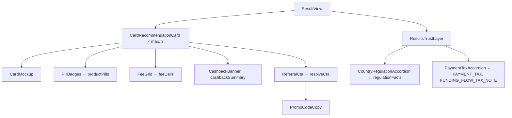

# Konzept: Ergebniskarte und Trust-Layer

Stand 2026-10-01 · Vorgabe für Lovable · gehört zu `docs/PRD.md`, Abschnitt 5
Code: `src/components/results/*`, Logik: `src/lib/presentation.ts`, Inhalte: `src/content/payment-tax.ts`
Vorschau (mobil, 430 px): `preview/ergebniskarte-vorschau.html`

## 1. Ziel

Der Finder zeigt höchstens drei Karten. Jede Karte beantwortet in dieser Reihenfolge:
1. Passt sie zu mir? (Highlight, Pills)
2. Was kostet sie? (Gebührenraster, Cashback-Zeile)
3. Worauf muss ich achten? (Warnungen)
4. Wer steht dahinter? (Herausgeberzeile, Trust-Layer)
5. Wie komme ich hin? (CTA mit Werbelabel)

Die Tabelle bleibt für Vergleichende (Seite `/compare`), der Finder ist der Hauptweg.

## 2. Abweichungen vom Ausgangs-Prompt

| Prompt | Umsetzung | Grund |
|---|---|---|
| Next.js 15 | React 18 + Vite in Lovable, Komponenten framework-neutral | Stack A ist entschieden. Lovable baut nach meinem Kenntnisstand Vite-Projekte [Wahrscheinlich]. Die Komponenten nutzen keine Next-APIs und laufen in beiden. |
| Tailwind v4 | Klassen funktionieren in v3 und v4; Verläufe als Inline-Style | Welche Version das Lovable-Projekt nutzt, ist offen [Vermutung]. `bg-gradient-*` wurde in v4 umbenannt. |
| Eigenes Interface `CryptoCard` | Felder in bestehende Typen integriert (`Product`, `CardDetails`, `FeeStructure`, `RewardStructure`, `Offer`) | Ein zweites Modell würde mit Matching, Filtern und Datenbank auseinanderlaufen. |
| `geoAvailability: {allowed, excluded}` | Bleibt Status je Land (`available/restricted/unavailable/unknown`) | Zwei Listen können "unbekannt" und "eingeschränkt" nicht abbilden. |
| `affiliate.referralUrl` im Client | Ziel-URL bleibt serverseitig, Link über `/go` | Austauschbarkeit, Klickzählung, keine Ziel-URLs im Bundle. |
| `ctaText` frei, z. B. "25 $ Bonus sichern" | Eigener CTA-Text nur mit gepflegten Bonusbedingungen, Prüfdatum ≤ 30 Tage, ohne verbotene Wörter; sonst "Zu {Anbieter}" | Ein Bonusversprechen ohne Bedingungen ist irreführend. |
| `badgeText` frei | Badge mit Art: redaktionell oder gesponsert; gesponsert wird so gekennzeichnet | Bezahlte Hervorhebung muss erkennbar sein. |
| Pill "MiCA Ready" | Pill nach Faktenlage: "MiCA-Zulassung", "MiCA über Bank", "EU-E-Geld-Herausgeber" oder "Keine EU-Zulassung" | Es gibt kein Siegel "MiCA Ready". Zugelassen ist ein Rechtsträger, kein Produkt. |
| Fußnote "*Werbelink / Affiliate", dezent | Label "Werbung" sichtbar direkt am Button, Offenlegung direkt darunter | Laut Recherche reicht ein Sternchen-Hinweis nicht. |
| `kycLevel: none` | Feld vorhanden; alle 13 geprüften Karten sind `full` | Regulierte EU-Kartenprogramme verlangen volles KYC. |
| Akkordeon "Der Stablecoin-Vorteil" | Ersetzt durch "Was beim Bezahlen mit Krypto steuerlich passiert" | Siehe Abschnitt 6. |
| Akkordeon "Warum diese Karte für dein Land geeignet ist" | "Verfügbarkeit und Regulierung in {Land}" | "Geeignet" klingt nach Eignungsprüfung (MiCA-Beratung). Das Modul zeigt Fakten, keine Eignung. |

## 3. Datenmodell (umgesetzt, Migration `003_card_details.sql`)

| Prompt-Feld | Typ im Code | Spalte | `null` heißt |
|---|---|---|---|
| `custodyType` | `Product.custody` (+ `hybrid`) | `custody` | – (Pflichtfeld) |
| `cardForm` | `CardDetails.forms: CardForm[]` | `card_forms text[]` | nicht geprüft; `{}` = geprüft: keine |
| `mobileWallets` | `CardDetails.mobileWallets: MobileWallet[]` | `mobile_wallets text[]` | nicht geprüft |
| `kycLevel` | `CardDetails.kycLevel` | `kyc_level` | nicht geprüft |
| `feeGrid.issuance` | `FeeStructure.issuanceVirtualEur`, `issuancePhysicalEur` | `fee_issuance_virtual_eur`, `fee_issuance_physical_eur` | nicht geprüft |
| `feeGrid.monthly` | `FeeStructure.monthlyEur` | `fee_monthly_eur` | nicht geprüft |
| `feeGrid.fxMarkupPercent` | `FeeStructure.fxMarkupPct` | `fee_fx_pct` | nicht geprüft |
| `feeGrid.atmFreeLimitPerMonth` | `FeeStructure.atmFreeLimitEurPerMonth` | `atm_free_limit_eur` | nicht geprüft; `0` = keine Freigrenze |
| `currency` | immer EUR (Feldnamen `*_eur`) | – | – |
| `rewards.*` | `RewardStructure` mit `staking.required/token/minEur/lockupDays` | `cashback_base_pct`, `cashback_max_pct`, `staking_*` | nicht geprüft |
| `supportedChains` | `Product.chains` | `chains text[]` | nicht geprüft |
| `supportedFundingCurrencies` | `Product.fundingAssets` | `funding_assets text[]` | nicht geprüft |
| `affiliate.ctaText` | `Offer.ctaText: I18n` | `affiliate_links.cta_text jsonb` | Standard-CTA |
| `affiliate.promoCode` | `Offer.promoCode` | `promo_code` (Muster geprüft) | kein Code |
| `affiliate.badgeText` | `Offer.badge {text, kind}` | `badge_text`, `badge_kind` (beide oder keins) | kein Badge |

Das Ranking nutzt für die Ausgabegebühr die physische Karte, ersatzweise die virtuelle. Die Methodik-Seite nennt das.

## 4. Anatomie der Ergebniskarte

```
┌───────────────────────────────────────────────┐
│ [Mockup]  [Top-Match für Zahlungen mit …]      │  1 Highlight aus Match-Badges
│           Bybit Card (EU)                     │  2 Name
│           Mastercard · Herausgeber: Via …     │  3 Netz + Kartenherausgeber
│ (MiCA-Zulassung)(Virtuelle Karte)(Apple Pay)  │  4 Pills, Warn-Pill immer zuerst
│ ┌───────────────┬───────────────┐             │
│ │ Ausgabe       │ Monatlich     │             │  5 Gebührenraster 2×2
│ │ 0 € / 0 €     │ 0 €           │             │    unbekannt = "–  nicht geprüft"
│ ├───────────────┼───────────────┤             │
│ │ Fremdwährung  │ Geldautomat   │             │
│ │ 0,5 %         │ 100 € /Monat  │             │
│ └───────────────┴───────────────┘             │
│ [2 % ohne Staking | bis zu 10 % mit MNT-…]    │  6 Cashback-Zeile
│ ⚠ Zahlung mit Krypto kann steuerlich …        │  7 Warnungen (immer sichtbar)
│ Warum dieses Match? • … • …                   │  8 max. 4 Gründe
│ [Konto bei Bybit EU nötig …]                  │  9 Kopplung Börse (gleicher Anbieter / On-Ramp)
│ [WERBUNG] [ Karte bestellen und Bonus …* ]    │ 10 CTA mit Label am Button
│ [BEISPIEL25            ] [Kopieren]           │ 11 Promo-Code (falls vorhanden)
│ * Bonusbedingungen …                          │ 12 Bedingungen
│ Partnerlink: … zählt mit 10 % …               │ 13 Offenlegung
│ ▸ So kommt die Reihenfolge zustande           │ 14 Score-Aufschlüsselung
└───────────────────────────────────────────────┘
```

**Verbindliche Regeln**

| # | Regel |
|---|---|
| R1 | Reihenfolge 1–14 nicht ändern. Warnungen nie in Tooltips verstecken. |
| R2 | `null` wird als "–  nicht geprüft" gezeigt, nie als 0, "nein" oder leer. |
| R3 | Pills nur aus geprüften Werten. "0 % FX" nur bei `fxMarkupPct === 0`. |
| R4 | Ohne Offer im Land: neutraler Button "Mehr zu {Anbieter}" zur internen Anbieterseite, ohne Werbelabel. |
| R5 | Mit Offer: Label "Werbung" (auf Länderseiten zweisprachig, z. B. "Ad · Publicité") direkt am Button, Offenlegung direkt darunter, `rel="sponsored noopener noreferrer"`, `target="_blank"`. |
| R6 | Eigener CTA-Text nur über `resolveCta()`. Lovable formuliert keine eigenen CTA-Texte. |
| R7 | Gesponserte Badges zeigen " · Gesponsert". |
| R8 | Mockup ohne Markenlogos und Markenfarben (Verlauf aus Slug). Logos nur, wenn eine Nutzungserlaubnis vorliegt (`logoUrl`). |
| R9 | Mobile first: Kartenbreite bis 28 rem, Touch-Ziele mind. 44 px, Fokus-Ring sichtbar, Kontrast WCAG AA. |

## 5. Trust-Layer unter den Ergebnissen

Zwei Akkordeons (native `<details>`, ohne Bibliothek), standardmäßig geschlossen.

**A. Verfügbarkeit und Regulierung in {Land}**, je angezeigter Karte:
- Verfügbarkeit im Land aus `product_availability`
- EU-Pass-Satz, wenn der maßgebliche Rechtsträger eine starke Zulassung in einem anderen EWR-Land hat, sonst "im Land selbst erteilt"
- Rechtsträger, gruppiert nach Gesellschaft: Rollen, Zulassung, Aufsicht, Sitz, Hinweis, Quelle
- Datenverantwortlicher: Sitz im EWR, außerhalb oder nicht offengelegt
- Bei fehlender EU-Zulassung: Bedeutung für den Nutzer (`NO_EU_AUTHORISATION_MEANING`)
- Einmal je Karte: Hinweis auf Sekundärquellen, solange nicht gegen das Register geprüft

**B. Was beim Bezahlen mit Krypto steuerlich passiert**:
- Drei Sätze je Land (`PAYMENT_TAX`), korrekt für Stablecoins
- Je angezeigter Karte ein Satz zum Funding-Flow (`FUNDING_FLOW_TAX_NOTE`)
- Hinweis bei unsicherer Rechtslage (IT, NL, MT, CY), Stand-Datum, `TAX_DISCLAIMER`, Quelle

## 6. Warum es kein Modul "Stablecoin-Vorteil" gibt

Ich widerspreche dem Prompt-Baustein. Die Aussage, Stablecoin-Zahlungen vermieden steuerliche Veräußerungsgewinne, ist nach unserer eigenen Recherche (Prompt 7) falsch. In DE, AT, FR, ES, IT und CY ist die Zahlung mit einem Stablecoin grundsätzlich eine Veräußerung. Bei Dollar-Stablecoins kann allein der Euro-Dollar-Kurs einen Gewinn erzeugen. Nur in den Niederlanden stimmt die Aussage im Ergebnis weitgehend, wegen der Box-3-Pauschalbesteuerung.

Stattdessen erklärt das Modul korrekt, was passiert, und nennt den echten Vorteil: Euro-Stablecoins erzeugen meist kaum Gewinn, die Dokumentation bleibt aber nötig. Das Risiko des Original-Bausteins wäre eine falsche Steueraussage gegenüber Verbrauchern, ein Abmahnrisiko nach UWG/UCPD und ein Vertrauensverlust bei genau der Zielgruppe, die den Unterschied kennt.

Ein Test schlägt fehl, sobald irgendwo "Stablecoin … steuerfrei/steuerneutral" auftaucht.

## 7. Komponenten-API

```tsx
import { CardRecommendationCard, ResultsTrustLayer } from "@/components/results";

<CardRecommendationCard
  result={r}                          // MatchResult aus matchCatalog()
  answers={answers}                   // QuizAnswers
  country={country}                   // Country aus fetchCatalog()
  lang={lang}
  position={i + 1}
  functionsBaseUrl={`${import.meta.env.VITE_SUPABASE_URL}/functions/v1`}
  today={new Date().toISOString().slice(0, 10)}
  providerPath={(slug) => `/${lang}/providers/${slug}`}
  pair={outcome.pairs.find((p) => p.cardSlug === r.product.slug) ?? null}
  onCtaClick={({ slug, position }) => track({ name: "affiliate_click", props: { slug, type: "card", position, source: "quiz", country: country.code } })}
/>

<ResultsTrustLayer results={[...outcome.cards, ...outcome.exchanges]} country={country} lang={lang} />
```



## 8. Prüfung

- 120 Unit-Tests gesamt (Stand nach Meilenstein-Umbau), davon 28 für Ergebniskarte und Trust-Layer, inklusive Server-Render der Komponenten: Label am Partner-CTA, kein Label ohne Offer, Promo-Code, 10 % in der Score-Aufschlüsselung, zwei Akkordeons, korrekte Stablecoin-Aussage.
- SQL-Verifikation mit Migration 003: Constraints für Wallets, Kartenform, KYC, Promo-Code, Badge (beide oder keins), Kartenfelder nur bei Karten.
- Visuelle Vorschau mobil gerendert und geprüft. Gefunden und behoben: doppelte Rechtsträger je Rolle, interne Prüfnotiz sichtbar, abgeschnittene Herausgeberzeile, falscher Anbieterpfad bei der Börsen-Kopplung.
