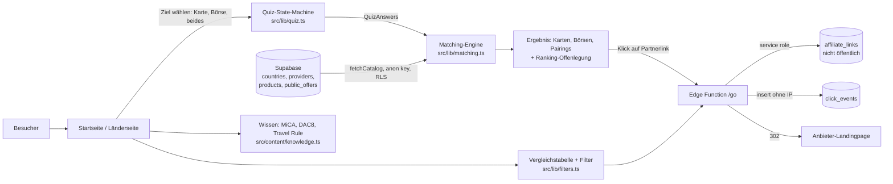
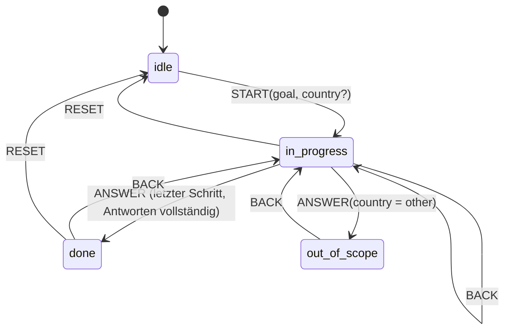
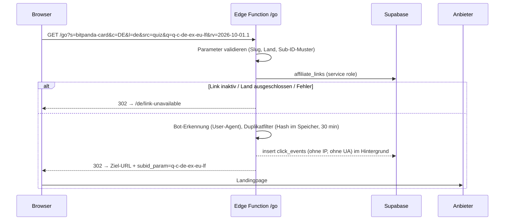

# PRD: Krypto-Spending-Guide (EU)

Stand: 2026-10-01 · Betreiber: DATAMINT LLC (Tiflis) · Methodik-Version 2026-10-01.1
Stack: Lovable (React/TypeScript/Vite/Tailwind) + Supabase (EU) · Sprachen: DE, EN
Startländer: DE, AT, FR, ES, IT, NL, MT, CY

## 0. Abweichungen vom Ausgangs-Prompt

Der Ausgangs-Prompt beschreibt ein globales Produkt. Dieses PRD setzt die getroffenen Entscheidungen um und korrigiert Punkte, die der Recherche widersprechen.

| Ausgangs-Prompt | Umsetzung hier | Grund |
|---|---|---|
| Global, inkl. USA/UK | Nur EU, 8 Startländer | Entscheidung Zielmarkt EU. UK (FCA-Promotion-Regime) und US (FICO, MSB) wären eigene Rechtsprojekte. |
| Geo-IP-Erfassung und -Sortierung | Länderwahl im Quiz und Länder-URLs (`/de/laender/at`) | SPA-SEO (Cloaking-Risiko), DSGVO-Aufwand, Edge-Logik. Geo-IP höchstens später als Vorschlagsbanner. |
| "Steuerneutrale Transaktionen via EURC/USDC nach DACH-Recht" | Gestrichen | Laut Recherche falsch für DE, AT, FR, ES, IT, CY. Zahlung mit Stablecoin ist dort grundsätzlich eine Veräußerung. |
| Statisches JSON als Datenquelle | Supabase als einzige Datenquelle, JSON nur als Seed | Ziel-URLs dürfen nicht im Client-Bundle liegen; Gebühren/Boni ändern sich ohne Deploy. |
| `MatchScore = w1·Feasibility + w2·Yield − w3·Fees` | Sechs normierte Faktoren inkl. offengelegter Provisionsgewichtung (10 %) | Entscheidung "Ranking mit offengelegter Gewichtung"; UCPD verlangt Offenlegung. |
| CTA "25 $ Willkommensbonus aktivieren" | Bonus nur mit Bedingungen, Stand-Datum und Werbelabel | Irreführungsrisiko bei unbelegten Bonusversprechen. |
| `subid={quiz_path}_{country}` | Nicht personenbezogener Pfad-Code `q-c-de-ow-sc-lf` | Datensparsamkeit; keine IDs, die Nutzer wiedererkennbar machen. |
| Client-Plausibilisierung gegen Bots | Server-seitige Bot-Markierung und flüchtiger Duplikatfilter in der Redirect-Function | Fingerprinting im Client wäre einwilligungspflichtig. |
| Trustpilot | Score, Sterne, Reviewanzahl per Schalter `trustpilot_display` | Entscheidung Peter; Lizenzanfrage läuft parallel (Paket 0.6). |

## 1. Executive Summary und Architektur

**Vision.** Menschen in der EU verstehen in unter einer Minute, welche Krypto-Karte oder Börse in ihrem Land verfügbar ist, wer dahintersteht, wie streng sie reguliert ist, was mit ihren Daten passiert, und klicken mit klarer Kennzeichnung auf den Partnerlink.

**Value Proposition.** Die großen Portale aus der Recherche vergleichen meist Gebühren und Cashback in Tabellen. Unser Unterschied liegt in drei Punkten:
1. Länderverfügbarkeit, Regulierung und Datenschutz je Rechtsträger in einem Flow.
2. Der Funding-Flow (wird bei jeder Zahlung Krypto verkauft?) als eigener Filter, mit Steuerhinweis je Land.
3. Komplexe Regeln (MiCA, DAC8, Travel Rule) in drei Ebenen: zwei Sätze, Details, Quellen.

**Kernmetriken**

| Metrik | Definition | Quelle |
|---|---|---|
| Quiz-Start-Rate | `quiz_start` / Sessions Startseite | Plausible |
| Quiz-Completion | `quiz_complete` / `quiz_start` | Plausible |
| Drop-off je Schritt | `quiz_step` je `step`-Index | Plausible |
| Quiz-to-Click | `affiliate_click{source=quiz}` / `quiz_complete` | Plausible |
| Human Clicks je Link | `click_stats_daily.human_clicks` | Supabase |
| Conversion je Programm | Netzwerk-Report / Human Clicks | Affiliate-Netzwerke |



## 2. Regulierungs- und Compliance-Matrix

### 2.1 Produktgrenzen (nicht verhandelbar)

Keine Orders, keine Wallets, keine Kundengelder, kein eingebettetes Kauf-/Swap-Widget, kein KYC-Datenfluss über unsere Seite, keine Fragen zu Vermögen, Anlageziel oder Risikobereitschaft. Grund: Damit bleibt DATAMINT außerhalb der georgischen VASP-Pflicht, außerhalb von DAC8 und außerhalb der MiCA-Beratung (FMA-Abgrenzung öffentlicher, nicht personalisierter Information).

### 2.2 EU-Rahmen, wie er im Produkt abgebildet wird

| Thema | Abbildung im Produkt |
|---|---|
| MiCA-Zulassung | `legal_entities.auth_status` je Rechtsträger; maßgeblich ist der Vertragspartner, nicht die Marke. |
| Custodial vs. Self-Custody | `products.custody`. Bei Self-Custody-Karten zählt der Kartenherausgeber für die Regulierungsnote, bei verwahrten Produkten der Krypto-Rechtsträger (`relevantAuthorization()`). |
| EMT / Stablecoins | `products.supported_stablecoins`; Hinweis `usdt_not_mica_compliant`. ART kommen bei den 14 Anbietern als Zahlungsmittel nicht vor. |
| Funding-Flow | `products.funding_flow`; Warnung `auto_sell_tax_event` bei Verkauf pro Zahlung. |
| Steuern | `countries.tax_summary` (Grundzüge, Quelle, `tax_uncertain`), Disclaimer `TAX_DISCLAIMER`. Keine Steueroptimierungs-Empfehlung. |
| Keine EU-Zulassung | Anbieter werden gezeigt (Entscheidung Peter) mit `NO_EU_AUTHORISATION_MEANING`: keine MiCA-Aufsicht, keine Segregationspflicht, Gerichtsstand evtl. außerhalb der EU. |

### 2.3 Pflicht-Kennzeichnungen (Texte in `src/lib/compliance.ts`)

| Element | Ort | Konstante |
|---|---|---|
| Werbelabel am Link, ggf. zweisprachig (`Ad · Publicité`) | jeder CTA mit Partnerlink | `adLabel(lang, country)` |
| Provision und Ranking-Einfluss | direkt unter dem CTA | `AFFILIATE_DISCLOSURE` |
| Sortierlogik mit Gewichtsanteil | über jeder Ergebnisliste und Tabelle | `RANKING_DISCLOSURE` |
| Quiz ist Filter, keine Beratung | Quiz-Ende | `QUIZ_DISCLAIMER` |
| Allgemeiner Haftungsausschluss | Footer jeder Seite | `GENERAL_DISCLAIMER` |
| Steuerhinweis | jede Steuer-Box | `TAX_DISCLAIMER` |
| Trustpilot-Herkunft und Prüfstand | neben jedem Score | `TRUSTPILOT_NOTE` |

Betreiberseitig vor Launch: EU-Vertreter nach Art. 27 DSGVO, Impressum mit georgischem Register und EU-Vertreter, Cookie-Banner mit gleichwertigem "Ablehnen" (nur nötig, falls nicht-notwendige Dienste eingebunden werden; Plausible allein setzt keine Cookies).

## 3. Datenmodell

Quelle der Wahrheit sind die Migrationen `001_init.sql` bis `004_exchange_fields.sql` und die Domain-Typen in `src/lib/types.ts`. Erweiterung um Kartenform, Mobile Wallets, KYC, Gebührenraster und CTA/Promo/Badge: siehe `docs/KONZEPT-ERGEBNISKARTE.md`. `null` bedeutet überall "unbekannt", nie "nein".

Abbildung der Prompt-Interfaces:

| Prompt-Interface | Umsetzung |
|---|---|
| `CryptoCard` | `Product` mit `type = "card"` und `card: CardDetails` (kind, network, mobileWallets) + `custody`, `fundingFlow`, `fundingAssets`, `chains`. Issuer über `Provider.entities` mit Rolle `card_issuer`. KYC als Text `Provider.kycNote` (alle EU-Anbieter verlangen volles KYC; ein Level-Enum hätte keinen Informationswert). |
| `FeeStructure` | `FeeStructure` (+ `tradingFeePct` für Börsen) |
| `RewardStructure` | `RewardStructure` mit `StakingRequirement` (token, minEur, lockupDays) |
| `GeoAvailability` | `Availability[]` je Startland mit Status `available/restricted/unavailable/unknown`. Keine US-Felder. |
| `AffiliateProgram` | öffentlich: `Offer` (Modell, Tracking-Typ, Bonus mit Bedingungen). Intern: `affiliate_links.target_url`, `subid_param`, `cookie_days`, `payout_note`. |

Beispiel 1, verwahrte Börsenkarte (Ausschnitt `data/seed.json`):

```json
{
  "slug": "bybit-eu-card", "type": "card", "name": "Bybit Card (EU)", "status": "active",
  "cardKind": "debit", "cardNetwork": "mastercard", "mobileWallets": null,
  "custody": "custodial", "fundingFlow": "mixed",
  "fundingAssets": ["EUR", "USDC", "EURC", "BTC", "ETH"], "stablecoins": ["USDC", "EURC"],
  "availability": { "DE": "available", "AT": "available", "FR": "available", "ES": "available",
                    "IT": "available", "NL": "available", "MT": "unavailable", "CY": "available" },
  "fees": null, "rewards": null, "confidence": "secondary"
}
```
Rechtsträger: Bybit EU GmbH (AT, FMA, `casp_art63`), Kartenherausgeber Via Payments UAB (LT, `emi`).

Beispiel 2, Self-Custody-Karte:

```json
{
  "slug": "gnosis-pay-card", "type": "card", "name": "Gnosis Pay Card",
  "status": "wind_down", "windDownDate": "2026-12-20",
  "cardKind": "debit", "cardNetwork": "visa",
  "custody": "self_custody", "fundingFlow": "prefunded_stablecoin",
  "fundingAssets": ["EURe"], "stablecoins": ["EURe"], "chains": ["gnosis"],
  "availability": { "DE": "unknown", "AT": "unknown", "FR": "unknown", "ES": "unknown",
                    "IT": "unknown", "NL": "unknown", "MT": "unknown", "CY": "unknown" },
  "confidence": "secondary"
}
```
Rechtsträger: Gnosis Pay Co Ltd (GB, `none_found`), Kartenherausgeber UAB Monavate (LT, `emi`). Das Einstellungsdatum stammt aus einer Sekundärquelle und muss geprüft werden.

**Datenstand Seed v1:** 14 Anbieter, 23 Produkte (14 Karten, 9 Börsen), 26 Rechtsträger, Steuer-Grundzüge für 8 Länder. Gebühren und Cashback sind bewusst leer und werden in Paket 0.9 aus den Preisverzeichnissen erfasst.

## 4. Matching-Engine und Quiz

### 4.1 Einstieg und Fragen

Das Ziel wählt der Nutzer über drei Hero-Buttons ("Karte finden", "Börse finden", "Beides"). Danach folgen maximal vier Fragen, auf Länderseiten drei, weil das Land vorbelegt ist.

| # | Frage | Optionen | Sichtbar | Wirkung |
|---|---|---|---|---|
| 1 | Land | 8 Startländer, "Anderes Land" | immer (außer Länderseite) | Harter Filter; "Anderes Land" → Out-of-scope-Hinweis |
| 2 | Wo liegen deine Kryptowerte? | Börse/App, eigene Wallet, Einstieg | Karte, beides | Custody-Passung (weich) |
| 3 | Womit bezahlen? | Euro-Guthaben, Stablecoins, BTC/ETH | Karte, beides | Asset-/Funding-Passung (weich) |
| 4 | Was ist dir am wichtigsten? | Karte: Gebühren, Cashback, kein Lock-up, Regulierung & Datenschutz · Börse: Gebühren, Regulierung & Datenschutz | immer | Wählt das Gewichtsprofil |



### 4.2 Harte Filter

1. Produkttyp passt zum Ziel.
2. Status nicht `discontinued`. Bei `wind_down` ausgeschlossen ab dem Einstellungsdatum, davor mit Warnung und Abzug.
3. Verfügbarkeit im gewählten Land nicht `unavailable`. `unknown` und `restricted` bleiben mit Warnung sichtbar.

Weich sind Custody, Asset, Staking und Regulierung. Sie fließen in den Score ein, schließen aber nichts aus. Damit gibt es keine leeren Ergebnisse durch zu strenge Filter.

### 4.3 Score

```
Score = 100 × Σ_f  Gewicht_f(Produkttyp, Priorität) × Teilscore_f      Teilscore ∈ [0, 1]
f ∈ { fit, cost, rewards, regulation, dataQuality, commercial }
```

| Faktor | Berechnung (Kurzform, Details in `ranking-config.ts`) |
|---|---|
| fit | 50 % Custody-Passung, 50 % Asset-Passung; −0,3 bei bevorstehender Einstellung; −0,3 bei Staking-Pflicht trotz "kein Lock-up" |
| cost | Karten: FX (0 % → 1, ≥ 3 % → 0; doppelt gewichtet bei Priorität Gebühren), Monatsgebühr (≥ 10 € → 0), Ausgabe (≥ 50 € → 0). Börsen: Handelsgebühr (≥ 1,5 % → 0). Unbekannt → 0,5. |
| rewards | Cashback ohne Lock-up, mit Lock-up nur wenn nicht ausgeschlossen; ≥ 3 % → 1. Unbekannt → 0,5. |
| regulation | 70 % Zulassung des maßgeblichen Rechtsträgers (CASP/Art. 60/Bank 1,0 · EMI 0,7 · ungeprüft 0,4 · keine 0) + 30 % Datenverantwortlicher im EWR (ja 1 · unbekannt 0,5 · nein 0) |
| dataQuality | verified 1,0 · secondary 0,6 · unverified 0,3 |
| commercial | 1, wenn für dieses Land ein aktiver Partnerlink existiert, sonst 0 |

Gewichte in Prozent (veröffentlicht auf der Methodik-Seite, generiert aus `describeMethodology()`):

| Profil | fit | cost | rewards | regulation | dataQuality | commercial |
|---|---|---|---|---|---|---|
| Karte · Gebühren | 30 | 35 | 5 | 15 | 5 | 10 |
| Karte · Cashback | 30 | 15 | 30 | 10 | 5 | 10 |
| Karte · kein Lock-up | 35 | 20 | 10 | 20 | 5 | 10 |
| Karte · Regulierung & Datenschutz | 30 | 15 | 5 | 35 | 5 | 10 |
| Börse · Gebühren | 30 | 35 | 0 | 20 | 5 | 10 |
| Börse · Regulierung & Datenschutz | 25 | 15 | 0 | 45 | 5 | 10 |
| Börse · Standard (bei "beides") | 30 | 25 | 0 | 30 | 5 | 10 |

Eigenschaft (getestet): Ein Partnerlink verschiebt den Score um genau 10 Punkte. Unbekannte Daten erhalten nie die Bestnote. Tie-Break nach Datenqualität, dann Slug, damit das Ergebnis deterministisch bleibt.

### 4.4 Ergebnis Karte und Börse (Empfehlung)

Ich empfehle **Karte primär, Börse als gekoppelte Ergänzung**, statt zwei gleichrangige Listen:

- **Verwahrte Karte:** Die Karte setzt ein Konto beim selben Anbieter voraus. Das Ergebnis zeigt deshalb "Karte X, Konto bei X nötig" als ein Paket (`relation = same_provider`), ohne zweite Entscheidung.
- **Self-Custody-Karte:** Der Nutzer braucht einen Weg, um Euro in den passenden Stablecoin zu tauschen. Das Ergebnis schlägt eine Börse vor, die diesen Stablecoin führt (`relation = on_ramp`).
- **Ziel "beides":** Karten-Paket oben, darunter eine eigene Börsenliste (max. 3) für Nutzer, die getrennt handeln wollen.
- **Ziel "Börse":** nur Börsenliste.

Trade-off: Eine kombinierte Ansicht ist einfacher, zeigt aber weniger Auswahl. Getrennte Listen bedeuten mehr Klickoptionen, aber auch mehr Entscheidungsaufwand und Widersprüche (Karte A + Börse B ohne Bezug). Das Pairing löst das, ohne die Liste zu verstecken.

### 4.5 Edge Cases

| Fall | Verhalten | Code |
|---|---|---|
| Kein Produkt im Land | Hinweis + Link zur Vergleichstabelle | `no_results` |
| Nur ein Produkt | Ein Ergebnis, Hinweis auf Tabelle | `single_result` |
| Eigene Wallet + Euro-Guthaben | Ergebnis normal, Hinweis zu Stablecoins | `contradiction_wallet_euro` |
| Land "Anderes Land" | Out-of-scope-Seite, keine Empfehlung | Status `out_of_scope` |
| Partnerlink im Land ausgeschlossen | Produkt bleibt, CTA wird Link zur Anbieterseite ohne Werbelabel | Warnung `link_unavailable_in_country` |
| Produkt wird eingestellt | Bis zum Datum mit Warnung, danach ausgeblendet | `wind_down` |
| Gebühren unbekannt | Neutral bewertet, Hinweis "Gebühren noch nicht geprüft" | `fees_unknown` |

## 5. UX/UI-Spezifikation

**Komponenten**

| Komponente | Verantwortung | Logik aus |
|---|---|---|
| `GoalPicker` | drei Hero-Buttons, startet das Quiz | `quizReducer(START)` |
| `QuizDialog` | ein Schritt pro Ansicht, Fortschritt "2 von 4", Zurück-Button, kein Page-Reload | `quizReducer`, `currentStep`, `QUIZ_STEPS` |
| `ResultView` | Ranking-Offenlegung, max. 3 Karten, Pairings, ggf. Börsenliste, Notes | `matchCatalog` |
| `CardRecommendationCard` | fertig gebaut, siehe `docs/KONZEPT-ERGEBNISKARTE.md` | `src/components/results` |
| `ScoreBreakdown` | aufklappbar: Beitrag je Faktor in Punkten | `MatchResult.contributions` |
| `EntityPanel` | Rechtsträger, Rolle, Sitz, Aufsicht, Zulassung, Datenverantwortlicher | `Provider.entities` |
| `ComparisonTable` | Filterleiste + Tabelle; unbekannte Werte als "?" mit Tooltip | `applyFilters` |
| `TrustpilotBadge` | Score, Sterne, Anzahl, Datum, Link, Hinweis; nur wenn `provider.trustpilot` gesetzt | `TRUSTPILOT_NOTE` |

**ProductCard, feste Reihenfolge**
1. Badges: "Beste Übereinstimmung", "Niedrigste Gebühren" (nur wenn Gebühren bekannt), "Bestes Cashback" (nur wenn bekannt).
2. Drei Fakten: Funding-Flow, Monatsgebühr/FX (oder "noch nicht geprüft"), Zulassung des maßgeblichen Rechtsträgers.
3. "Warum dieses Match?" aus `reasons`.
4. Warnungen aus `warnings`, sichtbar, nicht im Tooltip versteckt. Bei `no_eu_authorisation_found` immer `NO_EU_AUTHORISATION_MEANING`.
5. CTA mit Label (`adLabel`) und `AFFILIATE_DISCLOSURE` direkt darunter.

**CTA-Copy-Regeln**
- Standard: "Zu {Anbieter}" / "Go to {provider}".
- Bonus nur, wenn `offer.bonusText` und `offer.bonusConditions` gesetzt und `bonusVerifiedAt` jünger als 30 Tage: "Zu {Anbieter}, {bonusText}*" mit Bedingungen direkt darunter.
- Verboten: "maximaler Bonus", "garantiert", "steuerfrei", "MiCA-konform", "sicher", Dringlichkeit ("nur heute").
- Kein CTA ohne Werbelabel.

## 6. Tracking, Analytics, Missbrauchsschutz

**Redirect** (`supabase/functions/go/index.ts`)



**Sub-ID:** `q-{goal}-{land}-{holding}-{asset}-{priorität}` für das Quiz, `t-de`, `cp-at`, `pp`, `k` für andere Quellen. Muster `^[a-z0-9-]{1,40}$` (DB-Constraint + Client-Prüfung).

**Event-Taxonomie** (Plausible, cookielos, typisiert in `tracking.ts`):
`quiz_start`, `quiz_step`, `quiz_back`, `quiz_out_of_scope`, `quiz_complete`, `result_view`, `affiliate_click`, `filter_change`, `trustpilot_outbound`.

**Missbrauchsschutz:** Bot-Markierung statt Blockade (Partner sollen den Klick trotzdem bekommen), Duplikatfilter ohne Persistenz, aggregierte Auswertung über `click_stats_daily` (nur service role), Retention 180 Tage per pg_cron.

## 7. Umsetzungsfahrplan

Gegliedert nach Lovables Vorgehen (Details und Prompts: `docs/LOVABLE_BRIEF.md`, `docs/LOVABLE_PROMPTS.md`). Parallel laufen die Stufe-0-Pakete (Affiliate-Anträge, Gebühren erfassen, EU-Vertreter, Rechtstexte).

| Meilenstein | Deliverables | Definition of Done |
|---|---|---|
| **Vorarbeit (erledigt)** | Migrationen 001–004, `src/lib/*`, Ergebniskarte, Trust-Layer, Rechner, Direktvergleich, Kategorien, 120 Tests, SQL-Verifikation | `npm test` und `npm run db:verify` grün |
| **M1 · Fundament** | Layout, Design-System, Routing DE/EN, Datenquelle Seed, Startseite | Abnahme M1 |
| **M2 · Filter und Vergleich** | Finder, Ergebnis, Vergleichstabelle mit Filtern, Direktvergleich, Methodik | Abnahme M2 |
| **M3 · Detailseiten und Rechner** | Produkt-, Anbieter-, Länder-, Kategorie-, Wissensseiten, Kostenrechner | Abnahme M3 |
| **M4 · Backend und Launch** | Supabase, `/go`, Partnerlinks, Plausible, Rechtstexte, SEO/Prerendering | Launch-Gate M4; erst danach öffentlich |
| **Danach** | Search Console, monatlicher Daten-Refresh, wöchentlicher Link-Check, A/B-Test nur auf CTA-Copy innerhalb der Regeln | laufend |

## 8. Risiken und offene Punkte

1. **SEO bei Lovable-SPA** [Wahrscheinlich]: Ohne Prerendering sieht Google bei Länder- und Anbieterseiten leeres HTML. Ob Lovable Prerendering inzwischen nativ bietet, ist ungeklärt. Fallback: Prerender-Dienst oder später Migration der Inhaltsseiten auf Astro, wobei `src/lib` unverändert bleibt.
2. **Affiliate-Links zu Anbietern ohne EU-Zulassung** (KAST, RedotPay, teils ether.fi): ESMA-Leitlinien zur Reverse Solicitation nennen Affiliate-Kampagnen ausdrücklich (Rn. 12, Anhang S. 13). Entscheidung Peter: Risiko wird getragen. Technisch steuerbar je Link über `affiliate_links.enabled` und `excluded_countries`.
3. **Trustpilot ohne Syndication-Lizenz:** Vertragsrisiko gegenüber Trustpilot. Technisch über `trustpilot_display` sofort abschaltbar.
4. **Datenlücken:** Gebühren und Cashback fehlen vollständig. Bis dahin entscheiden Passung und Regulierung das Ranking.
5. **Georgien:** Gewinnsteuer, MwSt, DBA, Quellensteuer und Zahlungswege sind offen. Das blockiert die erste Auszahlung, nicht den Bau.
6. **Schema-Korrektur:** In `001_init.sql` hieß die Spalte `legal_entities.authorization`; das ist in Postgres ein reserviertes Wort. Sie heißt jetzt `auth_status`.
